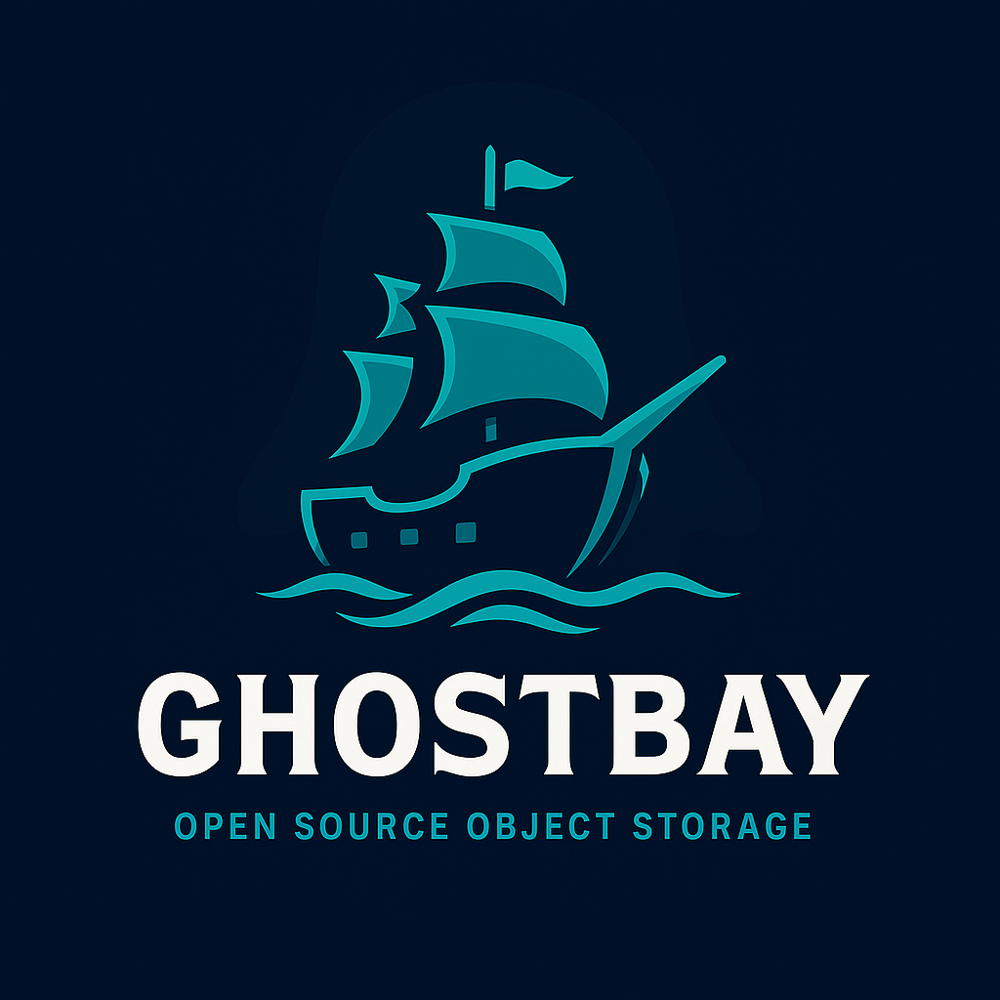

  

# GhostBay 🌊

---

## Overview

**GhostBay** is a modern, self-hostable, **S3-compatible object storage system** built in Rust.
Think of it as a **developer-friendly MinIO alternative** with Ghost-ecosystem integrations.

Designed for speed, resilience, and simplicity: whether you’re backing up a personal project or running multi-petabyte clusters, GhostBay provides secure, scalable storage you can actually control.

---

## ✨ Features

* 🔑 **S3 API Compatible** – works seamlessly with existing S3 clients (AWS CLI, rclone, restic, etc.)
* ⚡ **Rust Core** – memory safety and high performance by default
* 🐳 **Easy Deployment** – single binary, Docker image, or Helm chart
* 🔐 **Security Built-In** – TLS, IAM policies, access keys, and audit logging
* 🛆 **Scalable** – run standalone or scale out into distributed clusters
* 🧹 **Ghost Ecosystem Ready** – integrates with GhostSnap (backups), GhostFlow (automation), and Zeke (CLI)
* 🌍 **Multi-Cloud & Hybrid Friendly** – backends for local disks, Azure Blob, Backblaze, Wasabi, and more (planned)

